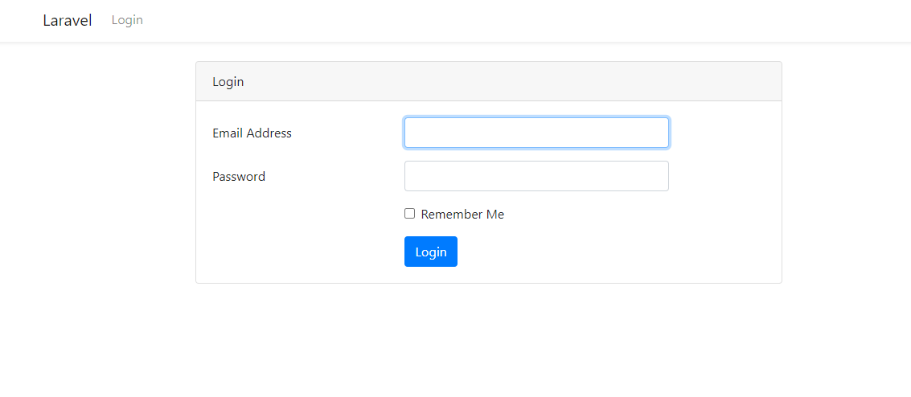
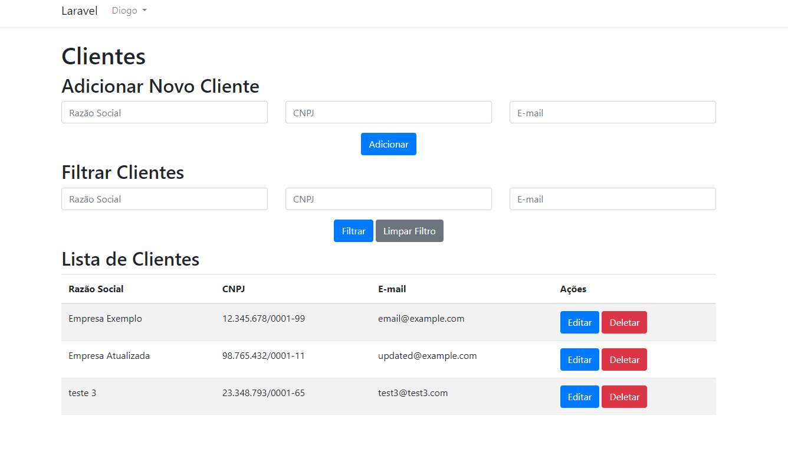

# Projeto CRUD Laravel

Este é um projeto CRUD (Create, Read, Update, Delete) simples desenvolvido em Laravel. Ele permite que você gerencie clientes, incluindo funcionalidades para adicionar novos clientes, listar todos os clientes, filtrar clientes por diferentes critérios e autenticar usuários com telas de login e registro.

## Funcionalidades

- **Adicionar Clientes**: Adicione novos clientes fornecendo informações como Razão Social, CNPJ e E-mail.
- **Listagem de Clientes**: Visualize todos os clientes cadastrados em uma tabela com suas informações.
- **Filtrar Clientes**: Filtre a lista de clientes com base em critérios como Razão Social, CNPJ e E-mail.
- **Tela de Login**: Faça login com um usuário existente para acessar as funcionalidades protegidas do sistema.
- **Tela de Registro**: Registre-se como um novo usuário para obter acesso ao sistema.

## Capturas de Tela



*Figura 1: Tela de Login*



*Figura 2: Tela do CRUD*

## Começando

### Pré-requisitos

- PHP >= 8.0.2
- Composer
- MySQL

### Instalação

1. Clone o repositório para o seu ambiente local:

   ```bash
   git clone https://github.com/seu-usuario/seu-repositorio.git

2. Navegue até o diretório do projeto:

   ```bash
   cd nome-do-projeto
   
3. Instale as dependências do Composer:

    ```bash
    composer install

4. Renomeie o arquivo .env.example para .env e configure as variáveis de ambiente, incluindo a conexão com o banco de dados MySQL

5. Execute as migrações do banco de dados para criar as tabelas necessárias:

   ```bash
    php artisan migrate

6. Inicie o servidor de desenvolvimento:

   ```bash
    php artisan serve
   
7. Acesse a aplicação em seu navegador usando o URL fornecido pelo comando php artisan serve.

## Testes
Este projeto inclui testes de unidade e testes de funcionalidade para garantir que as funcionalidades estejam corretas. Para executar os testes, use o seguinte comando:
    
    php artisan test
    
## Contribuição
Contribuições são bem-vindas! Se você encontrar um bug, tiver uma solicitação de recurso ou quiser melhorar a aplicação de qualquer forma, sinta-se à vontade para abrir uma issue ou enviar um pull request.

## Licença
Este projeto é licenciado sob a [licença MIT](https://opensource.org/licenses/MIT).

